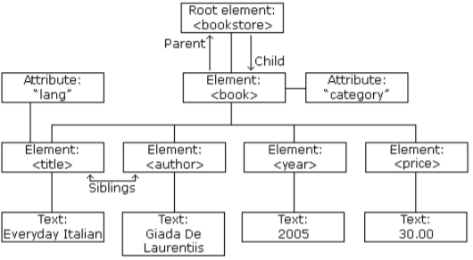
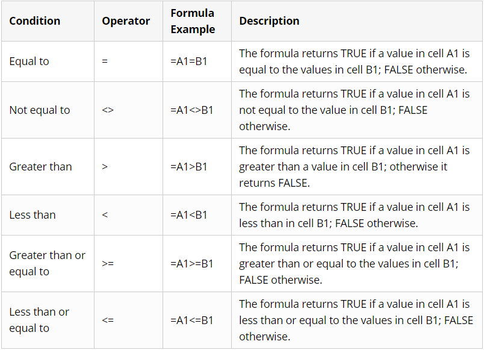

## Създаване на XML документ и пространство от имена

#### Цели на упражнението:

```
1. Да се упражнят правилата за добре оформен XML    
2. Редактиране на XML                               
3. Създаване на XML                                 
4. Използване на CDATA секции                      
5. Използване на encoding                           
6. Използване на пространство от имена             
7. Структуриране на информация в XML документ       

```

#### Задача 1: Поправете грешките, допуснати в по-долу дадения XML файл

```xml
<?xml version="1.0"?>

<name>Бисквитена торта</name>
<author>Анонимен</author>
<address site=www.recipes.com>
<ingredients>
  <list>
    <item>1 пакет бисквити
    <item>1 кофичка кисело мляко
    <item>1 бурканче сладко
  </list>
</ingredients>
<process>
  <P>Разбъркваме млякото и сладкото. Един ред бисквити, един ред от сместа и пак така, 
  най-отгоре поръсваме орехи. Изчаква се до омекване на бисквитите.</p>
  <p><i>Много вкусно!</p></i>
</process>
```

#### Задача 2: Направете следните промени в XML файла от <i>задача 1</i>


1. Добавете 2 нови елемента <b><i>item</i></b>
2. В елемента <b><i>recipe</i></b> заменете неговия под-елемент <b><i>author</i></b> с атрибут
3. В елемента <b><i>address</i></b> заменете неговия атрибут <b><i>site</i></b> с негов под-елемент
4. В елемента <b><i>recipe</i></b> добавете негов под-елемент <b><i>images</i></b>, включващ няколко под-елемента <b><i>image</i></b>

#### Задача 3: По дадената по-долу схема съставете XML файл



#### Задача 4: Използвайки CDATA секции, съставете XML файл, структуриращ информацията (относно логическите оператори в Excel), дадена в таблицата по-долу:



**Упътване**

```
Една CDATA секция представя текстово съдържание на XML елемент и позволява включване на специални XML знаци.
```

**Синтаксис:**

```xml
<![CDATA[ ..... ]]>
```

**Пример:**

```xml 
<![CDATA[ if(x > y && x > max) { max = x;} ]]> 
```

#### Задача 6:  Създайте XML файл и използвайте правилния encoding, за да представите по-долу дадените изрази.

Пробвайте във вашия браузер как тези изрази ще бъдат представени, ако използвате encoding ISO-8859-1


```
1. ∀ x ∈ {y-10, y+10} ∃ i
2. Einführung
3. Γεια Γιάννη
4. 嗨你好
```

#### Задача 7:  Като използвате пространство от имена, обединете дадените по-долу 2 XML файла в един документ

```xml
<book> 
  <title>A true story</title> 
  <description>A real cool publication</description> 
</book>
```

```xml
<record> 
  <name>Miller</name> 
  <title>Dr. </title> 
  <publications> ... </publications> 
</record> 
```

#### Задача 8:  Използвайки информацията от следния линк: <a href="http://programata.bg/?p=31&l=1&c=1&id=7037" target="_blank">http://programata.bg/?p=31&l=1&c=1&id=7037 </a>описващ програмата на кино Cinema City Paradise, създайте XML файл, структуриращ следната информация:


```
1. Обща информация за Cinema City Paradise - адрес, телефон, описание и т.н.
2. Цените на билетите от понеделник до неделя
3. За всеки филм - дата и час на прожекция
```
