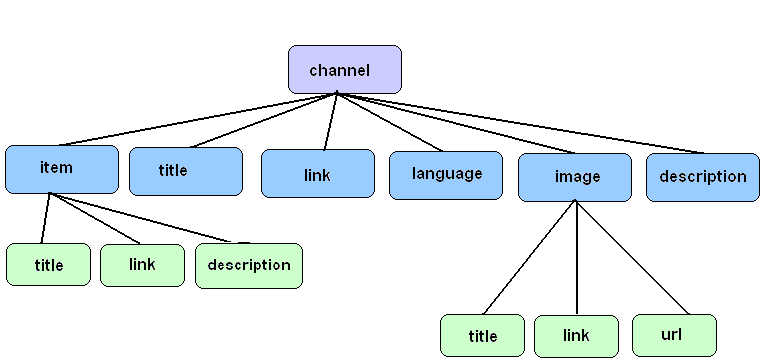
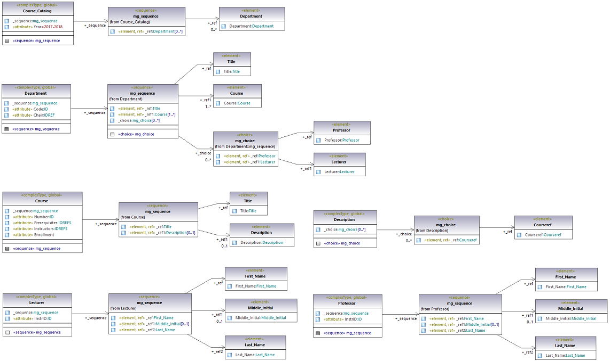

# XML валидация чрез DTD

## Цели на упражнението:

```
1.  Валидация на XML документ с вътрешно и външно DTD
2.  Използване на ENTITY (общо, параметризирано, вложено)
3.  Използване на нотации
4.  Упражняване на основните елементи на DTD - ID, IDREF, #REQUIRED, #IMPLIED и т.н.       
```


  **Задача 1: Свържете и валидирайте дадения по-долу XML файл с дадения DTD документ по следните 2 начина:**
- **С вътрешен DTD**

- **С външен DTD**


```xml
<?xml version="1.0"?>	

<shiporder orderid="889923">	
   <orderperson>John Smith</orderperson>	
   <shipto>	
       <name>Ola Nordmann</name>	
       <address>Langgt 23</address>	
       <city>4000 Stavanger</city>	
       <country>Norway</country>	
   </shipto>	
   <item>	
       <title>Empire Burlesque</title>	
       <note>Special Edition</note>	
       <quantity>1</quantity>	
       <price>10.90</price>	
   </item>	
   <item>	
       <title>Hide your heart</title>	
       <quantity>1</quantity>	
       <price>9.90</price>	
   </item>	
</shiporder>
```

```xml
<?xml version="1.0"?>	

<!DOCTYPE shiporder[	
  <!ELEMENT shiporder (orderperson,shipto,item+)>	
  <!ATTLIST shiporder orderid CDATA #REQUIRED>	
  <!ELEMENT orderperson (#PCDATA)>	
  <!ELEMENT shipto (name,address,city,country)>	
  <!ELEMENT name (#PCDATA)>	
  <!ELEMENT address (#PCDATA)>	
  <!ELEMENT city (#PCDATA)>	
  <!ELEMENT country (#PCDATA)>	
  <!ELEMENT item (title,note?,quantity,price)>	
  <!ELEMENT title (#PCDATA)>	
  <!ELEMENT note (#PCDATA)>	
  <!ELEMENT quantity (#PCDATA)>	
  <!ELEMENT price (#PCDATA)>	
]>
```

***Упътване:***

*Синтаксис за включване на външен DTD документ:*

```xml
<!DOCTYPE root-element SYSTEM "file-name"> 
```

*Синтаксис за включване на вътрешен DTD документ:*

```xml
<!DOCTYPE root-element [element-declarations]>
```

#### Задача 2: За дадения по-долу XML файл създайте DTD документ и го валидирайте спрямо него.

```xml
<?xml version="1.0"?> 
<games>	
    <game score="1-1">	
       <home-team>Roma</home-team>	
       <ex-team>Lazio</ex-team>	
       <scores>	
          <score me="15">	
            <player>Klose</player>	
          </score>	
          <score me="85" type="penalty">	
            <player>Tox</player>	
          </score>	
       </scores>	
       <yellows>	
           <player>Tox</player>	
           <player>Hernanes</player>	
       </yellows>	
       <reds>	
           <player>Kjaer</player>	
       </reds>	
    </game>	
</games>
```

#### Задача 3: За дадения по-долу DTD документ създайте XML файл и го валидирайте спрямо него.

```xml
<?xml version="1.0" encoding="UTF-8"?> 
<!ELEMENT Chair (Professor)> 
<!ELEMENT Title (#PCDATA)> 
<!ELEMENT Course (Title, Description?, Instructors, Prerequisites?)> 
<!ATTLIST Course 
          Number (CS106A | CS106B | CS107 | CS109 | CS124 | CS143 | CS145 | CS221 | CS228 | CS229 | EE108A | EE108B | LING180) #REQUIRED 
          Enrollment (1070 | 110 | 130 | 180 | 280 | 320 | 500 | 60 | 620 | 90) #IMPLIED 
> 
<!ELEMENT Prereq (#PCDATA)> 
<!ELEMENT Lecturer (First_Name, Middle_Initial?, Last_Name)> 
<!ELEMENT Last_Name (#PCDATA)> 
<!ELEMENT Professor (First_Name, Middle_Initial?, Last_Name)> 
<!ELEMENT Department (Title, Chair, Course+)> 
<!ATTLIST Department Code (CS | EE | LING) #REQUIRED> 
<!ELEMENT First_Name (#PCDATA)> 
<!ELEMENT Description (#PCDATA)> 
<!ELEMENT Instructors ((Lecturer, Professor*) | (Professor+, Lecturer?))> 
<!ELEMENT Prerequisites (Prereq+)> 
<!ELEMENT Course_Catalog (Department+)> 
<!ELEMENT Middle_Initial (#PCDATA)>
```

#### Задача 4: За DTD документа, намиращ се на адрес: <a href="http://www.w3.org/TR/xhtml1/DTD/xhtml1-transitional.dtd">http://www.w3.org/TR/xhtml1/DTD/xhtml1-transitional.dtd</a>, създайте XML файл. 

Включете в XML файла дадения DTD документ като публичен и го валидирайте спрямо него.

***Упътване:***

*Синтаксис за включване на публичен външен DTD документ:* 

```xml
<!DOCTYPE rootname PUBLIC FPI URL> 
```

<i> Пример:</i>

```xml 
<?xml version="1.0"?> 
<!DOCTYPE rss PUBLIC "-//RSS//DTD RSS 0.91//EN" "http://rss.com/publish/formats/rss-0.91.dtd"> 
<rss version="0.91"> 
  <channel> ...... </channel> 
</rss> 
```

#### Задача 5:  За дадената по-долу схема създайте DTD документ и XML файл и го валидирайте спрямо него. DTD документът трябва да изпълнява следните условия:

<pre>
1. Елементът <b><i>channel</i></b> има атрибут с име <b><i>version</i></b>
2. Под-елементите на <b><i>channel</i></b> имат следния ред на подреждане: 
    <b><i>item</i></b>, <b><i>title</i></b>, <b><i>link</i></b>,<b><i>image</i></b>, <b><i>language</i></b> и <b><i>description</i></b>
3. Под-елементите на <b><i>channel</i></b> - <b><i>item</i></b>, <b><i>title</i></b>, <b><i>link</i></b> и <b><i>description</i></b> - са задължителни, а останалите елементи - 
    <b><i>image</i></b> и <b><i>language</i></b> - не
4. Елементите <b><i>item</i></b> и <b><i>image</i></b> могат да се срещат много пъти
5. Под-елементите на <b><i>item</i></b> (т.е. <b><i>title</i></b>, <b><i>link</i></b>, <b><i>description</i></b>) и <b><i>image</i></b> (т.е. <b><i>title</i></b>, <b><i>link</i></b>, <b><i>url</i></b>) нямат определена 
    последователност
6. Под-елементът <b><i>description</i></b> на <b><i>item</i></b> е незадължителен
</pre>



#### Задача 6: Съставете DTD граматика, която позволява да бъдат представени в XML документ резултатите от футболните мачове и включва следната информация:

1. Футболните отбори участващи в един мач
2. Крайния резултат за всеки мач
3. Играчите отбелязали гол в мача
4. Времето, в което е отбелязан всеки гол
5. Играчите получили наказателни картони (жълти или червени)

#### Задача 7:  Да се включи в DTD файла от <i>задача 5</i> и да се използва в XML файл:


1. Една вътрешна (<b>System</b>) и една външна декларация (<b>Public</b>) на DTD нотация за някои от MIME типовете <b><i>image/jpeg</i></b>, 
    <b><i>image/png</i></b> или <b><i>image/gif</i></b>. След това да се декларира ENTITY, използващо тези 2 нотации
2. Общо ENTITY, задаващо стойността на под-елемента <b><i>link</i></b> на елемента <b><i>image</i></b>
3. Параметризирано ENTITY със стойност <b><i>"title"</i></b> и да се използва навсякъде, където тази дума се среща в DTD файла
4. Вложено ENTITY в ENTITY
5. <span style="color: red">Рекурсивно entity</span>

<b><i>Упътване</i></b>

<i>Синтаксис за дефиниране на нотации: </i>

```xml
<!NOTATION Name SYSTEM SystemLiternal> 
  или 
<!NOTATION Name PUBLIC PublicID> 
  или 
<!NOTATION Name PUBLIC PublicID SystemID>
```

<i>Пример:</i>

```xml
<!NOTATION gif SYSTEM "image/gif">
<!NOTATION gif Public "GIF">
```

<i>Синтаксис за дефиниране на общо ENTITY: </i>

```xml
<!ENTITY name definition> 
```

<i>Синтаксис за дефиниране на външно общо ENTITY: </i>

```xml
<!ENTITY name SYSTEM uri> 
  или 
<!ENTITY name PUBLIC FPI uri>
```

<i>Синтаксис за дефиниране на общо ENTITY, което използва нотации: </i>

```xml
<!ENTITY name SYSTEM/PUBLIC uri NDATA notationName> 
```

<i>Синтаксис за дефиниране на параметрично ENTITY: </i>

```xml
<!ENTITY % name definition> 
    или 
<!ENTITY % name SYSTEM uri> 
    или 
<!ENTITY % name PUBLIC FPI uri>
```


#### Задача 8: За по-долу дадените XML файл и схема да се създаде DTD документ, в който са налични:

1. <b>ID</b>, <b>IDREF</b> и <b>IDREFS</b>, за атрибутите, при които това е необходимо 
    (напр. за <i>InstrID</i>, <i>Code</i>,<i>Instructors</i>)
2. <b>#REQUIRED</b>, за атрибутите, при които това е необходимо (напр. за <i>Number</i>)
3. <b>#IMPLIED</b>, за атрибутите, при които това е приложимо (напр. за <i>Enrollment</i>)
4. <b>#FIXED</b>, за атрибут по избор

```xml
<?xml version="1.0"?> 

<Course_Catalog Year="2017-2018"> 
    <Department Code="CS" Chair="JW"> 
   	   <Title>Computer Science</Title> 
   	   <Course Number="CS106A" Instructors="JC ER MS" Enrollment="1070"> 
   	       <Title>Programming Methodology</Title> 
   	       <Description>
             Introduction to the engineering of computer applications emphasizing modern
             software engineering principles.
           </Description>
   	   </Course> 
   	   <Course Number="CS106B" Prerequisites="CS106A" Instructors="JC ER" Enrollment="620"> 
   	       <Title>Programming Abstractions</Title> 
   	       <Description>
             Abstraction and its relation to programming.
           </Description> 
   	   </Course> 
   	   <Course Number="CS107" Prerequisites="CS106B" Instructors="JZ" Enrollment="500"> 
   	       <Title>Computer Organization and Systems</Title> 
   	       <Description>
               Introduction to the fundamental concepts of computer systems.
           </Description> 
   	   </Course> 
   	   <Course Number="CS109" Prerequisites="CS106B" Instructors="MS" Enrollment="280"> 
   	       <Title>Introduction to Probability for Computer Scientists</Title> 
   	   </Course> 
   	   <Course Number="CS124" Prerequisites="CS107 CS109" Instructors="DJ" Enrollment="60"> 
   	       <Title>From Languages to Information</Title> 
   	       <Description>
             Natural language processing. Cross-listed as 
             <Courseref Number="LING180"/>.
	         </Description>
   	   </Course> 
   	   <Course Number="CS143" Prerequisites="CS107" Instructors="AA" Enrollment="90"> 
   	       <Title>Compilers</Title> 
   	       <Description>
             Principles and practices for design and implementation of compilers 
             and interpreters.
           </Description>
   	   </Course> 
   	   <Course Number="CS145" Prerequisites="CS107" Instructors="JW" Enrollment="130"> 
   	       <Title>Introduction to Databases</Title> 
   	       <Description>
             Database design and use of database management systems for applications.
           </Description> 
   	   </Course> 
   	   <Course Number="CS221" Prerequisites="CS107" Instructors="AN ST" Enrollment="180"> 
   	       <Title>Artificial Intelligence: Principles and Techniques</Title> 
   	   </Course> 
   	   <Course Number="CS228" Instructors="DK" Enrollment="110"> 
   	       <Title>Structured Probabilistic Models: Principles and Techniques</Title> 
   	       <Description>
                Using probabilistic modeling languages to represent complex domains.
           </Description> 
   	   </Course> 
   	   <Course Number="CS229" Instructors="AN" Enrollment="320"> 
   	       <Title>Machine Learning</Title> 
   	       <Description>
                A broad introduction to machine learning and statistical 
                pattern recognition.
           </Description>
   	   </Course> 
   	   <Professor InstrID="AA"> 
   	       <First_Name>Alex</First_Name> 
   	       <Middle_Initial>S.</Middle_Initial> 
   	       <Last_Name>Aiken</Last_Name> 
   	   </Professor> 
   	   <Lecturer InstrID="JC"> 
   	       <First_Name>Jerry</First_Name> 
   	       <Middle_Initial>R.</Middle_Initial> 
   	       <Last_Name>Cain</Last_Name> 
   	   </Lecturer> 
   	   <Professor InstrID="DK"> 
   	       <First_Name>Daphne</First_Name> 
   	       <Last_Name>Koller</Last_Name> 
   	   </Professor> 
   	   <Professor InstrID="AN"> 
   	       <First_Name>Andrew</First_Name> 
   	       <Last_Name>Ng</Last_Name> 
   	   </Professor> 
   	   <Professor InstrID="ER"> 
   	       <First_Name>Eric</First_Name> 
   	       <Last_Name>Roberts</Last_Name> 
   	   </Professor> 
   	   <Professor InstrID="MS"> 
   	       <First_Name>Mehran</First_Name> 
   	       <Last_Name>Sahami</Last_Name> 
   	   </Professor> 
   	   <Professor InstrID="ST"> 
   	       <First_Name>Sebastian</First_Name> 
   	       <Last_Name>Thrun</Last_Name> 
   	   </Professor> 
   	   <Professor InstrID="JW"> 
   	       <First_Name>Jennifer</First_Name> 
   	       <Last_Name>Widom</Last_Name> 
   	   </Professor> 
   	   <Lecturer InstrID="JZ"> 
   	       <First_Name>Julie</First_Name> 
   	       <Last_Name>Zelenski</Last_Name> 
   	   </Lecturer> 
    </Department> 
    <Department Code="EE" Chair="MH"> 
   	   <Title>Electrical Engineering</Title> 
   	   <Course Number="EE108A" Instructors="SM"> 
   	       <Title>Digital Systems I</Title> 
   	       <Description>
                Digital circuit, logic, and system design.
           </Description> 
   	   </Course> 
   	   <Course Number="EE108B" Prerequisites="EE108A CS106B" Instructors="WD OO"> 
   	       <Title>Digital Systems II</Title> 
   	       <Description>
                The design of processor-based digital systems.
           </Description> 
   	   </Course> 
   	   <Professor InstrID="WD"> 
   	       <First_Name>William</First_Name> 
   	       <Middle_Initial>J.</Middle_Initial> 
   	       <Last_Name>Dally</Last_Name> 
   	   </Professor> 
   	   <Professor InstrID="MH"> 
   	       <First_Name>Mark</First_Name> 
   	       <Middle_Initial>A.</Middle_Initial> 
   	       <Last_Name>Horowitz</Last_Name> 
   	   </Professor> 
   	   <Professor InstrID="SM"> 
   	       <First_Name>Subhasish</First_Name> 
   	       <Last_Name>Mitra</Last_Name> 
   	   </Professor> 
   	   <Professor InstrID="OO"> 
   	       <First_Name>Oyekunle</First_Name> 
   	       <Last_Name>Olukotun</Last_Name> 
   	   </Professor> 
    </Department> 
    <Department Code="LING" Chair="BL"> 
   	   <Title>Linguistics</Title> 
   	   <Course Number="LING180" Prerequisites="CS107 CS109" Instructors="DJ" Enrollment="60"> 
   	       <Title>From Languages to Information</Title> 
   	       <Description>
                Natural language processing. Cross-listed as <Courseref Number="CS124"/>.
           </Description>
   	   </Course> 
   	   <Professor InstrID="DJ"> 
   	       <First_Name>Dan</First_Name> 
   	       <Last_Name>Jurafsky</Last_Name> 
   	   </Professor> 
   	   <Professor InstrID="BL"> 
   	       <First_Name>Beth</First_Name> 
   	       <Last_Name>Levin</Last_Name> 
   	   </Professor> 
    </Department> 
</Course_Catalog>
```



#### Задача 9: Използвайки параметрични ENTITY и условни секции, декларирайте по-долу описаните 2 варианта за елемента channel в DTD документa от <i>задача 6</i>. Включете/Изключете всеки един от двата варианта и направете съответните промени в XML файла

1. Вариант 1: Елементът <b><i>channel</i></b> включва само задължителните под-елементи, дефинирани в <i>задача 6</i> - т.е. 
    <b><i>item</i></b>, <b><i>title</i></b>, <b><i>link</i></b> и <b><i>description</i></b>
2. Вариант 2: Елементът <b><i>channel</i></b> включва всички под-елементи, дефинирани в <i>задача 6</i> - т.е. <b><i>item</i></b>, 
    <b><i>title</i></b>, <b><i>link</i></b> и <b><i>description</i></b>, <b><i>image</i></b> и <b><i>language</i></b>

<b><i>Упътване</i></b>

```
DTD документите дават възможност да бъдат включвани и изключвани дадени декларации от тях чрез условните секции. 
Ключовата дума INCLUDE специфицира декларации, които са включени в DTD документа, а ключовата дума IGNORE 
обратното.
```


<i>Синтаксис:</i> 

```xml
<![ IGNORE [DTD Declarations]]>
<![ INCLUDE [DTD Declarations]]>
```

```
Обикновено условните секции се използват в комбинация с параметризирани ENTITY по следния начин: 
```

```xml
<!ENTITY % ignoredPart "IGNORE">
<![%ignoredPart;[<!ELEMENT element (sub-element1*, sub-element2, sub-element3)>]]>
```

```
Условните секции могат да бъдат използвани само във външен DTD документ
```